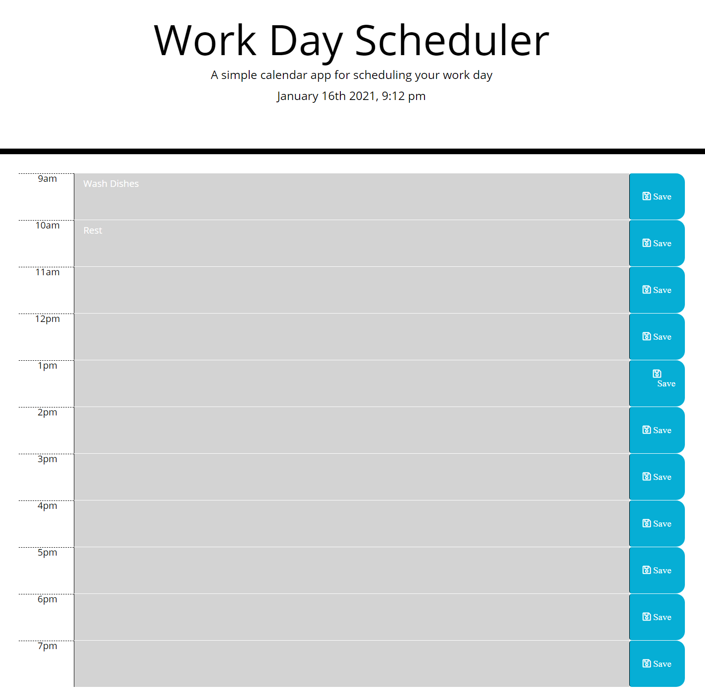

# Roseanne Nguyen's Portfolio
My name is Roseanne Nguyen, and I am currently a Full Stack Web Development student through the University of Arizona. Check out my portfolio below!

## Deployed-Link

https://roseannenguyen.github.io/Portfolio/

# Below are two projects mentioned in this portfolio:

### Work Day Scheduler Application Description

The Work Day Scheduler is an application that allows users to plan and schedule work day tasks. This app will run in the browser and feature dynamically updated HTML and Bootstrap powered by jQuery.
#### Desktop Screenshot

#### Technologies-Used

* [Weather API](https://openweathermap.org/api)
* [Bootstrap Framework](https://getbootstrap.com/)

#### Deployed-Link

https://tiffcrockett.github.io/Dinner-Movie-App/

### Date Night Application Description

The Date night application is designed to help individuals plan the perfect dinner and a movie date. The application takes in the users movie choice and zip code in order to provide a curated list of restaurants that would best go with their movie choice.
#### Desktop Screenshot

#### Desktop search example Screenshot

#### Technologies-Used

* [Yelp API](https://www.yelp.com/developers/documentation/v3)
* [TMDB API](https://www.themoviedb.org/documentation/api)
* [W3.CSS Framework](https://www.w3schools.com/w3css/default.asp)

#### Deployed-Link

https://tiffcrockett.github.io/Dinner-Movie-App/

#### Previous repo

https://github.com/roseannenguyen/Date-Night-API

#### Credits

* [Tiffany Crockett](https://github.com/tiffcrockett)
* [Roseanne Nguyen](https://github.com/roseannenguyen)
* [Martin Mondaca](https://github.com/martinmondaca)

#### License
Licensed under [MIT](https://choosealicense.com/licenses/mit/) license.
